# ДЗ 3. Репликация

>
> 1. *Выбираем 2 запроса на чтение (/user/get/{id} и /user/search из спецификации).*
> *Составить план нагрузочного тестирования, который шлет запросы на эти api.*
> 2. *Создаем нагрузку на чтение с помощью составленного на предыдущем шаге плана, делаем замеры.*

<br>
Поскольку тест осуществлялся в локальном окружении на одной физической машине, для достижения адекватных результатов контейнеры БД были запущены с ограничениями по ресурсам. Запуск без ограничений по ресурсам в режиме репликации приводил к падению пропускной способности из-за конкуренции.

```yaml
    ...
      resources:
        limits:
          cpus: '1'
          memory: 1g
    ...
```

В связи с этим показатели задержки и пропускной способности значительно отличаются от результатов, полученных в ДЗ 2 - ограничение ресурсов привело к падению числа транзакций и увеличению таймингов обработки запроса.

## Тест 1 (100 VU, 10 MIN, 1 SEC RAMP UP, 300 SEC DURATION)
Latency. Верхняя черта - запрос поиска по списку `/profile/list`, нижняя - получение пользователя по id `/profile/{id}`
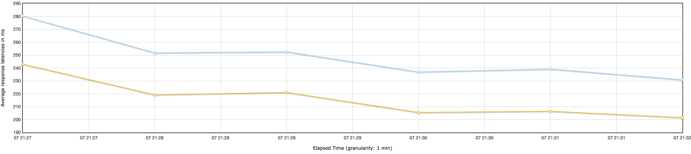
Кол-во транзакций в секунду. Верхняя черта - запрос поиска по списку `/profile/list`, нижняя - получение пользователя по id `/profile/{id}`
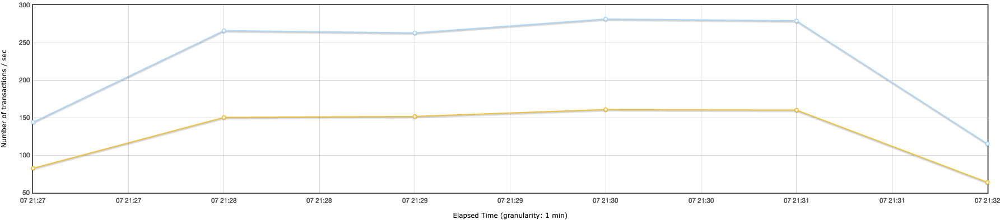
Общее кол-во транзакций в секунду
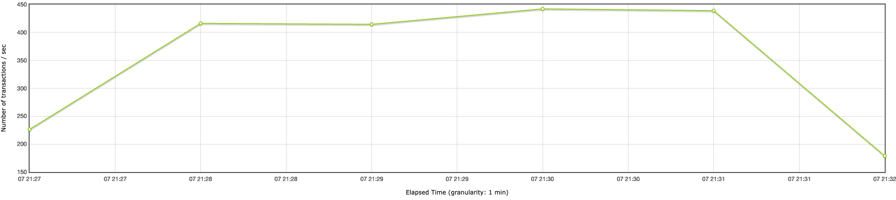

## Тест 2 (1000 VU, 10 MIN, 0 SEC RAMP UP, 600 SEC DURATION)
Latency. Верхняя черта - запрос поиска по списку `/profile/list`, нижняя - получение пользователя по id `/profile/{id}`
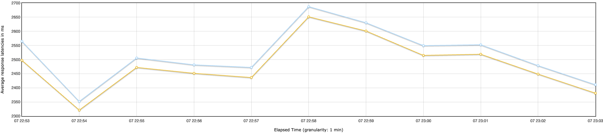
Кол-во транзакций в секунду. Верхняя черта - запрос поиска по списку `/profile/list`, нижняя - получение пользователя по id `/profile/{id}`
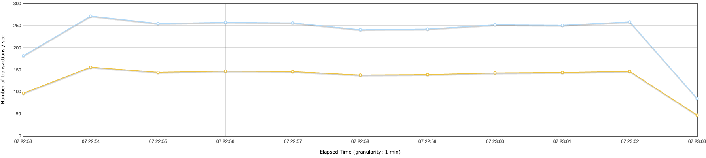
Общее кол-во транзакций в секунду
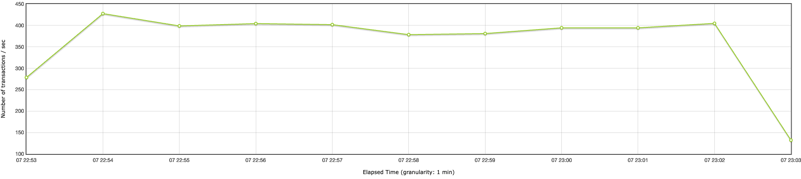

<br>

Данный результат сначала показался мне странным - как количество обращений для получения пользователя по ключу может быть меньше, чем кол-во поисков по списку? Однако затем я всмомнил, что в тесте настроен `If Controller`, пропускающий вызов эндпоинта `/profile/{id}`, если поиск случайных значений по `/profile/list` не дал результатов.

## После репликации

> 3. *Настроить 2 слейва и 1 мастер. Включить потоковую репликацию.*

<br>
Добавляем в docker-compose создание контейнеров с мастером и слейвами:

```yml
...
...
postgres-master:
    image: postgres:18.3
    container_name: hl_postgres_master
...
...
postgres-slave1:
    image: postgres:18.3
    container_name: hl_postgres_slave1
...
...
postgres-slave2:
    image: postgres:18.3
    container_name: hl_postgres_slave2
...
...
```

Добавляем конфиг файлы с необходимыми для репликации настройками:
<p>
db/master/pg_hba.conf

```
...
# Allow replication connections from slaves
host    replication     replicator      0.0.0.0/0               md5
...
```

db/master/postgresql.conf
```
...
wal_level = replica
max_wal_senders = 10
...
...
max_replication_slots = 10
...
```

db/slave/postgresql.conf
```
...
wal_level = replica
...
...
```

Создаем пользователя "replicator" и слоты для репликации:
```sql
-- Create replication user for streaming replication
DO
$$
BEGIN
   IF NOT EXISTS (SELECT FROM pg_catalog.pg_roles WHERE rolname = 'replicator') THEN
      CREATE ROLE replicator WITH REPLICATION LOGIN PASSWORD 'replicator_pass';
   END IF;
END
$$;

-- Create replication slot for slave1
SELECT pg_create_physical_replication_slot('slave1_slot');

-- Create replication slot for slave2
SELECT pg_create_physical_replication_slot('slave2_slot');

```
<br>

> 4. *Настроить бекенд приложение на работу с реплицированной бд*


Routing запросов между master/slave реализован **на уровне application layer вручную**, через разделение пулов подключений для записи и чтения.

* в Go отсутствует стандартный framework-аналог `@Transactional(readOnly=true/false)`;
* управление соединениями и маршрутизацией SQL-запросов обычно осуществляется явно в коде;
* это обеспечивает прозрачный контроль над тем, какие запросы направляются на master, а какие — на replica.

В конфигурацию приложения добавлена поддержка списка replica-hosts:

`internal/config/config.go`

```go
type Config struct {
    ...
    DBReplicaHosts string
    ...
}
```

Replica DSN формируются динамически:

```go
func (c Config) ReplicaDSNs() []string {
    if c.DBReplicaHosts == "" {
        return []string{c.DSN()}
    }

    hosts := strings.Split(c.DBReplicaHosts, ",")
    dsns := make([]string, 0, len(hosts))

    for _, h := range hosts {
        h = strings.TrimSpace(h)
        if h != "" {
            dsns = append(dsns, fmt.Sprintf(
                "postgres://%s:%s@%s/%s?sslmode=disable",
                c.DBUser, c.DBPassword, h, c.DBName,
            ))
        }
    }

    if len(dsns) == 0 {
        return []string{c.DSN()}
    }

    return dsns
}
```
<br>

Для балансировки чтения между несколькими replica реализован `ReplicaPool`, работающий по алгоритму **Round Robin**:

`internal/store/replica_pool.go`

```go
type ReplicaPool struct {
    pools []*pgxpool.Pool
    next  atomic.Uint64
}
```

Выбор replica:

```go
func (r *ReplicaPool) pool() *pgxpool.Pool {
    if len(r.pools) == 1 {
        return r.pools[0]
    }

    i := r.next.Add(1) % uint64(len(r.pools))
    return r.pools[i]
}
```
<br>

В store-слое используются отдельные подключения:

```go
type UserStore struct {
    master  DB
    replica DB
}
```

Операции записи направляются на master

```go
func (s *UserStore) Create(...) {
    row := s.master.QueryRow(ctx,
        `INSERT INTO users (...) VALUES (...) RETURNING ...`,
    )
}
```

Операции чтения направляются на replica

```go
func (s *UserStore) GetByID(...) {
    err := s.replica.QueryRow(ctx,
        `SELECT ... FROM users WHERE id=$1`,
        id,
    )
}
```

```go
func (s *UserStore) GetByUsername(...) {
    err := s.replica.QueryRow(ctx,
        `SELECT ... FROM users WHERE username=$1`,
        username,
    )
}
```
<br>

> 5. *Создаем нагрузку на чтение с помощью составленного на предыдущем шаге плана, делаем замеры. Добавить сравнение результатов в отчет.*

## Тест 1 (100 VU, 10 MIN, 1 SEC RAMP UP, 300 SEC DURATION) - после репликации
Latency. Верхняя черта - запрос поиска по списку (/profile/list), нижняя - получение пользователя по id (/profile/{id})
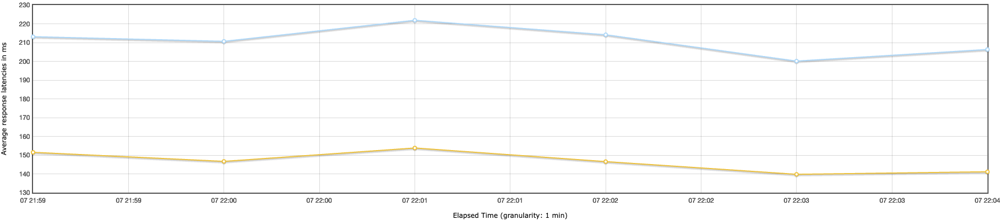
Кол-во транзакций в секунду. Верхняя черта - запрос поиска по списку (/profile/list), нижняя - получение пользователя по id (/profile/{id})
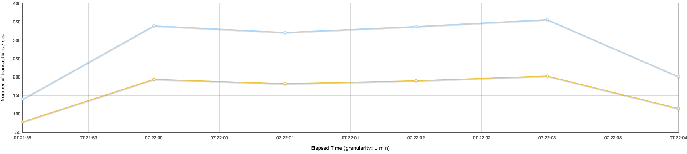
Общее кол-во транзакций в секунду
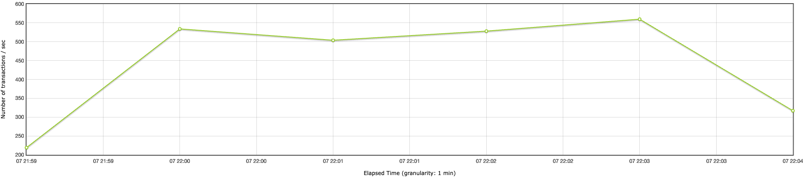

## Тест 2 (1000 VU, 10 MIN, 0 SEC RAMP UP, 600 SEC DURATION) - после репликации
Latency. Верхняя черта - запрос поиска по списку (/profile/list), нижняя - получение пользователя по id (/profile/{id})
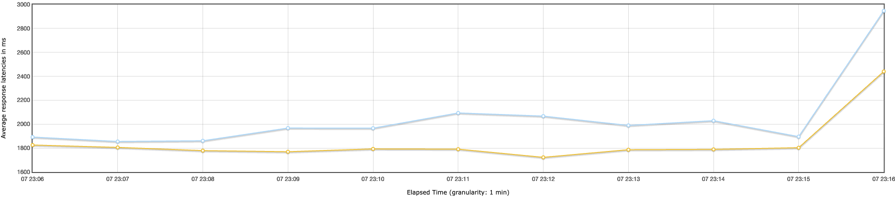
Кол-во транзакций в секунду. Верхняя черта - запрос поиска по списку (/profile/list), нижняя - получение пользователя по id (/profile/{id})
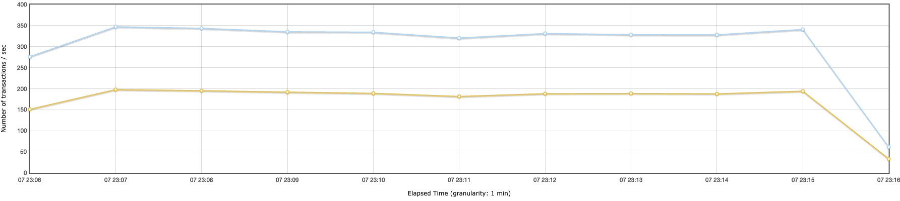
Общее кол-во транзакций в секунду
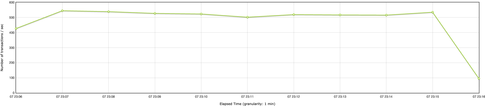

<br>

После настройки репликации виден прирост кол-ва транзакций в секунду примерно на 100-120 единиц.

## Кворумная синхронная репликация

> 6. *Настроить кворумную синхронную репликацию.*
<br>

Добавляем апдейт конфигурации для поддержки синхронного коммита

`db/init/004_set_synchronous_commit.sql`
```sql
ALTER SYSTEM SET synchronous_commit = on;
ALTER SYSTEM SET synchronous_standby_names = 'ANY 2 (*)';
SELECT pg_reload_conf();
```

<br>

> 7. *Создать нагрузку на запись в любую тестовую таблицу. На стороне, которой нагружаем считать, сколько строк мы успешно записали.*

<br>
Для создания нагрузки на запись воспользуемся postman скриптом из ДЗ 2. Запустим его с параметрами 100 VU / 10 min

<br>

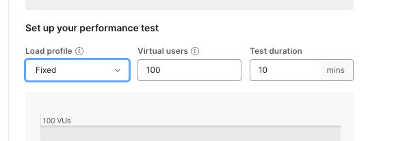

<br>

Для подсчета количества успешных созданий новых пользователей используем эндпоинт `/metrics` нашего приложения.
<p>

Нас будет интересовать параметр `http_requests_total{method="POST",path="/auth/register",status="2xx"}`, со статусом 2хх,
отражающий кол-во успешных обращений к эндпоинту создания пользователей

<p>

Проверим кол-во записей в таблице `users` до запуска теста на всех узлах кластера.

Мастер:

```
myproject % docker exec -it hl_postgres_master psql -U social_user -d social
psql (18.3 (Debian 18.3-1.pgdg13+1))
Type "help" for help.

social=# SELECT count(*) FROM users;
  count  
---------
 1045554
(1 row)
```

<p>

Реплика 1:

```
myproject % docker exec -it hl_postgres_slave1 psql -U social_user -d social
psql (18.3 (Debian 18.3-1.pgdg13+1))
Type "help" for help.

social=# SELECT count(*) FROM users;
  count  
---------
 1045554
```

<p>

Реплика 2:

```
myproject % docker exec -it hl_postgres_slave2 psql -U social_user -d social
psql (18.3 (Debian 18.3-1.pgdg13+1))
Type "help" for help.

social=# SELECT count(*) FROM users;
  count  
---------
 1045554
(1 row)
```

<p>

Запускаем тест.

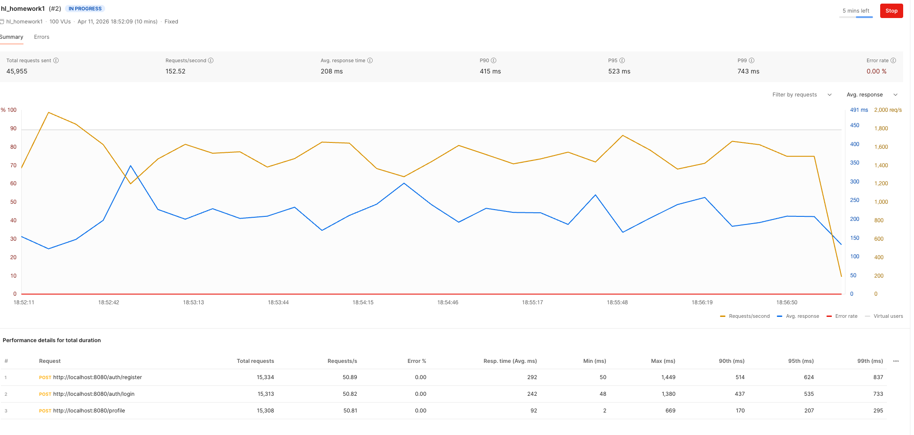


> 8. *Убиваем мастер узел (kill -9, docker stop)*


По прошествии 5 минут отключаем мастер-узел БД

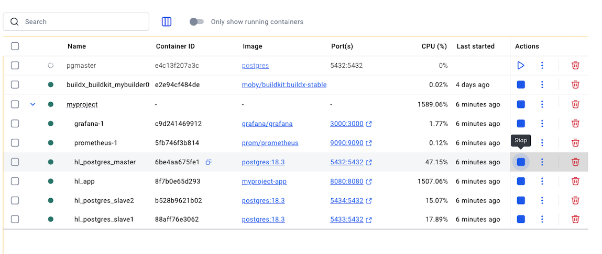

> 9. *Заканчиваем нагрузку на запись.*

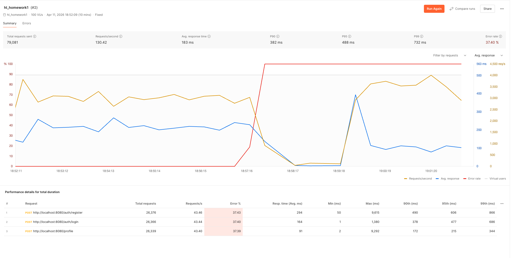


> 10. *Выбираем самый свежий слейв. Промоутим его до мастера. Переключаем на него второй слейв.*

```sql
myproject % docker exec -it hl_postgres_slave1 psql -U social_user -d social
psql (18.3 (Debian 18.3-1.pgdg13+1))
Type "help" for help.

social=# SELECT 
    pg_last_wal_receive_lsn() as received_lsn,  -- Что получили от мастера
    pg_last_wal_replay_lsn() as replayed_lsn,   -- Что применили
    pg_last_xact_replay_timestamp() as last_replay_time;  -- Когда применили последнюю транзакцию
 received_lsn | replayed_lsn |       last_replay_time        
--------------+--------------+-------------------------------
 0/71239888   | 0/71239888   | 2026-04-11 15:57:36.368006+00
(1 row)

```

```sql
myproject % docker exec -it hl_postgres_slave2 psql -U social_user -d social
psql (18.3 (Debian 18.3-1.pgdg13+1))
Type "help" for help.

social=# SELECT 
    pg_last_wal_receive_lsn() as received_lsn,  -- Что получили от мастера
    pg_last_wal_replay_lsn() as replayed_lsn,   -- Что применили
    pg_last_xact_replay_timestamp() as last_replay_time;  -- Когда применили последнюю транзакцию
 received_lsn | replayed_lsn |       last_replay_time        
--------------+--------------+-------------------------------
 0/71239888   | 0/71239888   | 2026-04-11 15:57:36.368006+00
```

Оба слейва подтвердили получение одних и тех же транзакций. Значит, они одинаковой свежести. Поскольку открыт терминал реплики 2, выберем ее как новый мастер. Выполним на реплике 2 команду:

```sql
social=# SELECT pg_promote();
 pg_promote 
------------
 t
(1 row)
```

Проверим recovery:

```sql
social=# SELECT pg_is_in_recovery();
 pg_is_in_recovery 
-------------------
 f
(1 row)
```

Зайдем в логи реплики 2

```
2026-04-11 19:21:26 2026-04-11 16:21:26.086 GMT [17] LOG:  waiting for WAL to become available at 0/712398A0
2026-04-11 19:21:30 2026-04-11 16:21:30.455 GMT [17] LOG:  received promote request
2026-04-11 19:21:30 2026-04-11 16:21:30.457 GMT [17] LOG:  redo done at 0/71239810 system usage: CPU: user: 7.80 s, system: 4.08 s, elapsed: 1813.97 s
2026-04-11 19:21:30 2026-04-11 16:21:30.457 GMT [17] LOG:  last completed transaction was at log time 2026-04-11 15:57:36.368006+00
2026-04-11 19:21:30 2026-04-11 16:21:30.466 GMT [17] LOG:  selected new timeline ID: 2
2026-04-11 19:21:30 2026-04-11 16:21:30.513 GMT [17] LOG:  archive recovery complete
2026-04-11 19:21:30 2026-04-11 16:21:30.522 GMT [15] LOG:  checkpoint starting: force
2026-04-11 19:21:30 2026-04-11 16:21:30.527 GMT [15] LOG:  checkpoint complete: wrote 0 buffers (0.0%), wrote 2 SLRU buffers; 0 WAL file(s) added, 0 removed, 0 recycled; write=0.003 s, sync=0.001 s, total=0.006 s; sync files=2, longest=0.001 s, average=0.001 s; distance=0 kB, estimate=134603 kB; lsn=0/71239950, redo lsn=0/712398F8
2026-04-11 19:21:30 2026-04-11 16:21:30.536 GMT [1] LOG:  database system is ready to accept connections
```

Как видно, реплика 2 успешно запромоучена до мастера.


Теперь необходимо переключить реплику 1 на новый мастер.
Останавливаем PostgreSQL внутри контейнера реплики 1:
```
docker exec hl_postgres_slave1 bash -c "pg_ctl stop -D /var/lib/postgresql/data" 2>/dev/null
```

Очищаем каталог с данными, чтобы загрузить туда бэкап и избежать "split brain"
```
docker exec hl_postgres_slave1 bash -c "rm -rf /var/lib/postgresql/data/*"
```


Добавляем запись в pg_hba.conf нового мастера чтобы реплики могли подключаться к нему
```
myproject % docker exec -it hl_postgres_slave2 bash

root@b528b9621b02:/# echo "host replication replicator all md5" >> /var/lib/postgresql/data/pg_hba.conf
root@b528b9621b02:/# exit
```

Перечитываем конфигурацию без перезапуска
```
myproject % docker exec -it hl_postgres_slave2 psql -U social_user -d social
psql (18.3 (Debian 18.3-1.pgdg13+1))
Type "help" for help.

social=# SELECT pg_reload_conf();
 pg_reload_conf
----------------
 t
(1 row)
```

Выполняем команду `pg_basebackup` на реплике 1
```
myproject % docker exec hl_postgres_slave1 bash -c "pg_basebackup -h hl_postgres_slave2 -U replicator -p 5432 -D /var/lib/postgresql/data -Fp -Xs -P -R"
waiting for checkpoint
167060/645970 kB (25%), 0/1 tablespace
427793/645970 kB (66%), 0/1 tablespace
645980/645980 kB (100%), 0/1 tablespace
645980/645980 kB (100%), 1/1 tablespace
```

После pg_basebackup некоторые файлы могли создаться от root, поэтому меняем владельца:
```
docker exec hl_postgres_slave1 bash -c "chown -R postgres:postgres /var/lib/postgresql/data"
```

Удаление привязки к replication slot со старого мастера:
```
docker exec hl_postgres_slave1 bash -c "sed -i 's/primary_slot_name.*//' /var/lib/postgresql/data/postgresql.auto.conf"
```

Запускаем postgres на реплике 1
```
myproject % docker exec --user postgres hl_postgres_slave1 pg_ctl start -D /var/lib/postgresql/data

waiting for server to start....2026-04-11 17:02:48.085 UTC [987] LOG:  starting PostgreSQL 18.3 (Debian 18.3-1.pgdg13+1) on aarch64-unknown-linux-gnu, compiled by gcc (Debian 14.2.0-19) 14.2.0, 64-bit
2026-04-11 17:02:48.086 UTC [987] LOG:  listening on IPv4 address "0.0.0.0", port 5432
2026-04-11 17:02:48.086 UTC [987] LOG:  listening on IPv6 address "::", port 5432
2026-04-11 17:02:48.088 UTC [987] LOG:  listening on Unix socket "/var/run/postgresql/.s.PGSQL.5432"
2026-04-11 17:02:48.090 UTC [993] LOG:  database system was shut down in recovery at 2026-04-11 17:00:40 UTC
2026-04-11 17:02:48.090 UTC [993] LOG:  entering standby mode
2026-04-11 17:02:48.092 UTC [993] LOG:  redo starts at 0/72000028
2026-04-11 17:02:48.092 UTC [993] LOG:  consistent recovery state reached at 0/73000000
2026-04-11 17:02:48.092 UTC [987] LOG:  database system is ready to accept read-only connections
2026-04-11 17:02:48.098 UTC [994] LOG:  started streaming WAL from primary at 0/73000000 on timeline 2
```

На реплике (slave1) проверяем режим восстановления:
```
myproject % docker exec --user postgres hl_postgres_slave1 psql -U social_user -d social -c "SELECT pg_is_in_recovery();"
 pg_is_in_recovery
-------------------
 t
(1 row)
```
`t` (true) означает, что сервер находится в режиме реплики.


На мастере (slave2) проверяем подключение реплики:
```
docker exec --user postgres hl_postgres_slave2 psql -U social_user -d social -c "SELECT application_name, state, sync_state FROM pg_stat_replication;"
 application_name |   state   | sync_state 
------------------+-----------+------------
 walreceiver      | streaming | async
(1 row)
```

<br>

> 11. *Проверяем, есть ли потери транзакций.*

<p>

Посмотрим статистику, собранную с помощью prometheus из нашего приложения.
```
http_requests_total{method="POST",path="/auth/register",status="2xx"} 16504
```

<p>

До отключения мастер-узла метрики успели зафиксировать добавление 16504 новых пользователей.

Сверим эти цифры с количеством записей, зафиксированных в базе

"Новый" мастер:

```
myproject % docker exec -it hl_postgres_slave2 psql -U social_user -d social
psql (18.3 (Debian 18.3-1.pgdg13+1))
Type "help" for help.

social=# SELECT count(*) FROM users;
  count  
---------
 1062060
(1 row)
```

Реплика 1:
```
myproject % docker exec -it hl_postgres_slave1 psql -U social_user -d social
psql (18.3 (Debian 18.3-1.pgdg13+1))
Type "help" for help.

social=# SELECT count(*) FROM users;
  count  
---------
 1062060
(1 row)
```


Количество записей до теста составляло 1045554.
Получим разность этих значений.
```
1062060-1045554=16506
```
Мы получили цифру, превышающую кол-во успешных обращений к эндпоинту "/auth/register". Невозможно однозначно сказать, почему так получилось. Возможно, механизм сбора статистики требует дополнительной настройки. Возможно, я запускал пару единичных тестов для проверки и забыл зафиксировать новые значения из базы перед началом основного теста. Но поскольку количество строк в базе не меньше кол-ва обращений на запись, можно утверждать, что потерь транзакций не произошло.