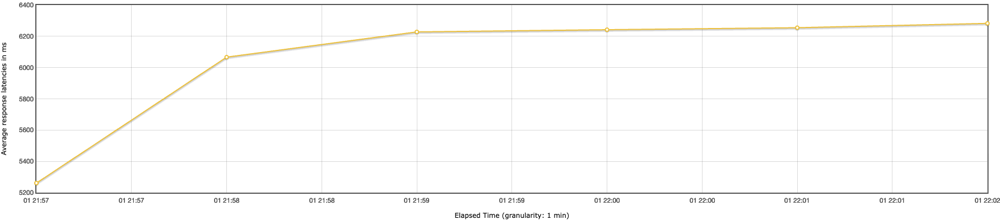
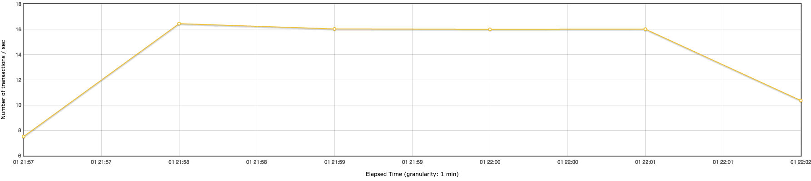
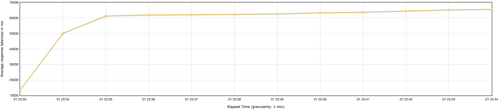
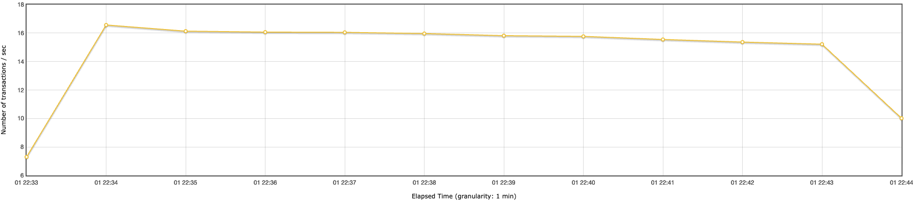
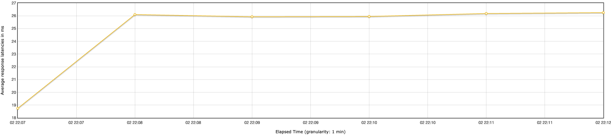
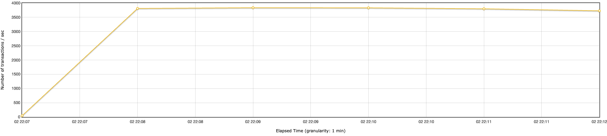
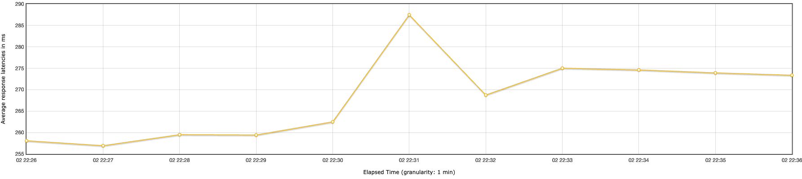
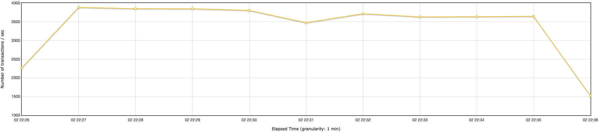

# ДЗ 2. Производительность индексов

## Подготовка

Для создания  1.000.000 пользовательских профилей был использован postman-скрипт из ДЗ 1 с некоторыми изменениями. В качестве источника данных был использован [репозиторий](https://github.com/Raven-SL/ru-pnames-list), содержащий список из 1638 имен и 14651 фамилии, соединявшихся в случайном порядке для создания пользовательского профиля. В результате выполнения скрипта достаточное для создания порядка миллиона записей раз, удалось получить следующие результаты:


Общее количество записей:
```sql
social=# SELECT count(*) FROM profile;
  count  
---------
 1034650
(1 row)
```

Количество уникальных комбинаций:
```sql
social=# SELECT COUNT(DISTINCT (name, surname)) FROM profile;
  count  
---------
 1012658
(1 row)
```

## Нагрузочное тестирование до создания индекса

В качестве инструмента для нагрузочного тестирования был выбран Apache Jmeter

### Тест 1
***Number of threads(users):*** 100

***Ramp-up period(s):*** 1

***Loop count:*** infinite

***Duration(seconds):*** 300

#### График Latency (Задержка)

*Рисунок 1. Динамика изменения задержки (Latency) до создания индекса. По оси X — время теста, по оси Y — время задержки в миллисекундах.*

#### График Throughput (Пропускная способность)

*Рисунок 2. Количество транзакций в секунду (TPS) до создания индекса. По оси X — время теста, по оси Y — количество транзакций в секунду.*
<br>

### Тест 2
***Number of threads(users):*** 1000

***Ramp-up period(s):*** 0

***Loop count:*** infinite

***Duration(seconds):*** 600

#### График Latency (Задержка)

*Рисунок 3. Динамика изменения задержки (Latency) до создания индекса. По оси X — время теста, по оси Y — время задержки в миллисекундах.*

#### График Throughput (Пропускная способность)

*Рисунок 4. Количество транзакций в секунду (TPS) до создания индекса. По оси X — время теста, по оси Y — количество транзакций в секунду.*

## Создаем индекс

```sql
CREATE INDEX name_idx
ON profile ((LOWER(name)) text_pattern_ops);

CREATE INDEX surname_idx
ON profile ((LOWER(surname)) text_pattern_ops);
```

Для индексирования полей был выбран B-Tree индекс, так как по условию задания поиск имен и фамилий производится по префиксу, соответственно, начало искомой строки всегда известно, что позволяет данному типу индекса производить поиск в четко определенном диапазоне

*Рисунок 5. Принцип работы LIKE запроса при использовании B-Tree индекса. Из статьи Thomas Dournet: How to Optimise PostgreSQL LIKE and ILIKE Queries (dev.to)*


> ... For patterns that start with known characters (suffix wildcards only like 'lap%' and not '%lap%'), a standard B-tree index works brilliantly. <br><br>
> [Thomas Dournet: How to Optimise PostgreSQL LIKE and ILIKE Queries][dev.to]

[dev.to]: https://dev.to/tdournet/how-to-optimise-postgresql-like-and-ilike-queries-494i

Поскольку поиск имён и фамилий должен выполняться без учёта регистра символов, используется функциональный индекс по выражению LOWER(column). Применение функции нормализации регистра на этапе построения индекса позволяет избежать вычислений над каждой строкой во время выполнения запроса и делает возможным использование индексного доступа для условий вида:

```sql
WHERE LOWER(name) LIKE 'иван%'
```

Без функционального индекса аналогичный регистронезависимый поиск (ILIKE) приводил бы к последовательному сканированию таблицы.

Дополнительно используется операторный класс text_pattern_ops. В базах данных с локализованной сортировкой (в частности, UTF-8 локалями для русского языка) стандартные правила сравнения строк не гарантируют лексикографическую непрерывность значений с одинаковым префиксом. Это препятствует корректному применению диапазонного поиска по B-tree индексу для оператора LIKE. Операторный класс text_pattern_ops задаёт побайтовую семантику сравнения строк, обеспечивая корректное отображение префиксного условия в индексный диапазон и тем самым позволяя оптимизатору использовать индекс.

```sql
EXPLAIN ANALYSE
SELECT * FROM profile WHERE (lower(name) LIKE lower('ник%') OR lower(surname) LIKE lower('ник%')) AND (lower(name) LIKE 'мар%' OR lower(surname) LIKE 'мар%');

QUERY PLAN
Bitmap Heap Scan on profile  (cost=288.97..683.62 rows=103 width=137) (actual time=3.923..5.614 rows=94.00 loops=1)
  Recheck Cond: (((lower((name)::text) ~~ 'ник%'::text) OR (lower((surname)::text) ~~ 'ник%'::text)) AND ((lower((name)::text) ~~ 'мар%'::text) OR (lower((surname)::text) ~~ 'мар%'::text)))
  Filter: (((lower((name)::text) ~~ 'ник%'::text) OR (lower((surname)::text) ~~ 'ник%'::text)) AND ((lower((name)::text) ~~ 'мар%'::text) OR (lower((surname)::text) ~~ 'мар%'::text)))
  Heap Blocks: exact=94
  Buffers: shared hit=102 read=35
  ->  BitmapAnd  (cost=288.97..288.97 rows=103 width=0) (actual time=3.858..3.859 rows=0.00 loops=1)
        Buffers: shared hit=43
        ->  BitmapOr  (cost=144.36..144.36 rows=10346 width=0) (actual time=1.010..1.011 rows=0.00 loops=1)
              Buffers: shared hit=13
              ->  Bitmap Index Scan on name_idx  (cost=0.00..72.16 rows=5173 width=0) (actual time=0.552..0.552 rows=4826.00 loops=1)
                    Index Cond: ((lower((name)::text) ~>=~ 'ник'::text) AND (lower((name)::text) ~<~ 'нил'::text))
                    Index Searches: 1
                    Buffers: shared hit=7
              ->  Bitmap Index Scan on surname_idx  (cost=0.00..72.16 rows=5173 width=0) (actual time=0.458..0.458 rows=3754.00 loops=1)
                    Index Cond: ((lower((surname)::text) ~>=~ 'ник'::text) AND (lower((surname)::text) ~<~ 'нил'::text))
                    Index Searches: 1
                    Buffers: shared hit=6
        ->  BitmapOr  (cost=144.36..144.36 rows=10346 width=0) (actual time=2.586..2.587 rows=0.00 loops=1)
              Buffers: shared hit=30
              ->  Bitmap Index Scan on name_idx  (cost=0.00..72.16 rows=5173 width=0) (actual time=1.430..1.430 rows=19158.00 loops=1)
                    Index Cond: ((lower((name)::text) ~>=~ 'мар'::text) AND (lower((name)::text) ~<~ 'мас'::text))
                    Index Searches: 1
                    Buffers: shared hit=20
              ->  Bitmap Index Scan on surname_idx  (cost=0.00..72.16 rows=5173 width=0) (actual time=1.156..1.156 rows=6660.00 loops=1)
                    Index Cond: ((lower((surname)::text) ~>=~ 'мар'::text) AND (lower((surname)::text) ~<~ 'мас'::text))
                    Index Searches: 1
                    Buffers: shared hit=10
Planning:
  Buffers: shared hit=129 read=26
Planning Time: 1.004 ms
Execution Time: 5.666 ms
```


## Нагрузочное тестирование после создания индекса

### Тест 1
***Number of threads(users):*** 100

***Ramp-up period(s):*** 1

***Loop count:*** infinite

***Duration(seconds):*** 300


#### График Latency (Задержка)

*Рисунок 6. Динамика изменения задержки (Latency) после создания индекса. По оси X — время теста, по оси Y — время задержки в миллисекундах.*

<!-- График демонстрирует, что время задержки  -->

#### График Throughput (Пропускная способность)

*Рисунок 7. Количество транзакций в секунду (TPS) после создания индекса. По оси X — время теста, по оси Y — количество транзакций в секунду.*
<br>

### Тест 2
***Number of threads(users):*** 1000

***Ramp-up period(s):*** 0

***Loop count:*** infinite

***Duration(seconds):*** 600

#### График Latency (Задержка)

*Рисунок 8. Динамика изменения задержки (Latency) после создания индекса. По оси X — время теста, по оси Y — время задержки в миллисекундах.*

#### График Throughput (Пропускная способность)

*Рисунок 9. Количество транзакций в секунду (TPS) после создания индекса. По оси X — время теста, по оси Y — количество транзакций в секунду.*

## Вывод
Ипользование индексов позволило снизить задержки приблизительно в 240 раз и увеличить пропускную способность приблизительно в 250 раз.